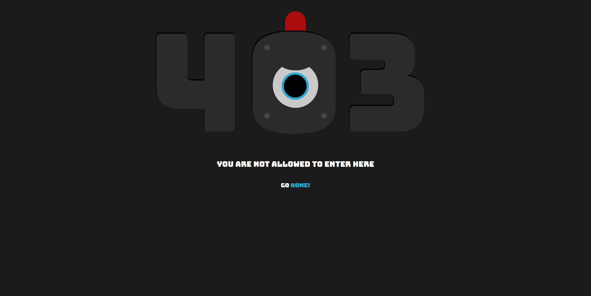

<p align="center" >
    
</p>

<br>

<div align="center">
  <a href="https://github.com/Game-K-Hack/TwitchLiveDownloader/releases/tag/1.1.0">
    
  </a>
  <a href="#">
    
  </a>
  <a href="https://choosealicense.com/licenses/mit">
    
  </a>
</div>

<h3 align="center">Guardian</h3>

<p align="center">
  <a href="#description">Description</a> •
  <a href="#installation">Installation</a> •
  <a href="#setting">Setting</a> •
  <a href="#functioning">Functioning</a>
</p>

<br>
<br>

## Description

It's a simple proxy for controlling and redirecting url patterns defined via regexes in the `rule.yml` file, and can also block urls. For each URL blocked or redirected, logs are created in a `data` folder.

## Installation

For this script to work, you must have Python in version 3.9 *(or a higher version)* and have installed the libraries with: `pip install -r requirements.txt`

#### Windows

Once the `mitmproxy` library has been installed, a folder is created in your user folder (for Windows): `C:/Users/%username%/.mitmproxy`. Install the `mitmproxy-ca-cert.cer` certificate in the `Trusted Root Certification Authorities` folder.

#### Linux

I don't know, but if anyone knows how to do it, I'd like to know how to complete this README.

## Setting

Activate logs *(`LOG=True`)* by modifying the `LOG` variable in the `proxy.py` file.

To modify the redirection and blocking rules, modify the `rule.yml` file. To block a URL, add the address to the `blacklist` category, and to add URLs to redirect, add the addresses to the `redirect` category.

```yaml
blacklist:
- .{0,}discord\.com.{0,}
redirect:
  http://127.0.0.1:5432:
  - .{0,}youtube\.com.{0,}
```
*In this example, URLs with the domain `discord.com` will be blocked, and URLs with the domain `youtube.com` will be redirected to `http://127.0.0.1:5432`.*

In this proxy there is a page published on port `5432` *(you can change the port in the `logger.py` file)* which indicates that this address is blocked by the proxy.



## Functioning


