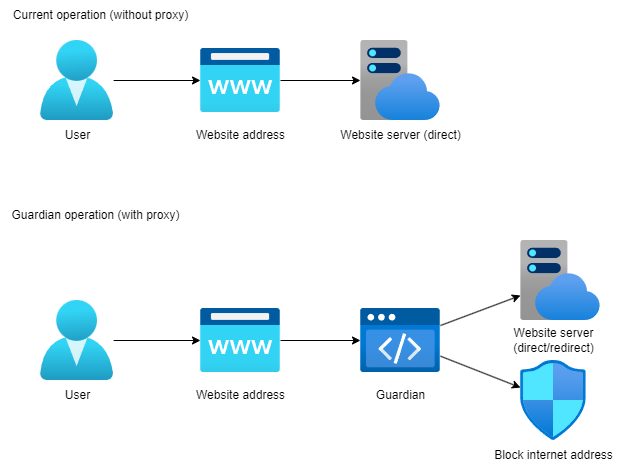

<p align="center" >
    
</p>

<br>

<div align="center">
  <a href="https://github.com/Game-K-Hack/TwitchLiveDownloader/releases/tag/1.1.0">
    
  </a>
  <a href="#">
    
  </a>
  <a href="https://choosealicense.com/licenses/mit">
    
  </a>
</div>

<h3 align="center">Guardian</h3>

<p align="center">
  <a href="#description">Description</a> •
  <a href="#installation">Installation</a> •
  <a href="#setting">Setting</a> •
  <a href="#functioning">Functioning</a>
</p>

<br>
<br>

## Description

C'est un simple proxy permettant de controler en redirigant des patterns d'url défini via des regex dans le fichier `rule.yml`, il peut aussi bloquer des urls. A chaque URL bloqué ou rediriger, des logs sont créer dans un dossier `data`.

## Installation

For this script to work, you must have Python in version 3.9 *(or a higher version)* and have installed the libraries with: `pip install -r requirements.txt`

#### Windows

Une fois la librairie `mitmproxy` installé, un dossier est créée dans votre dossier utilisateur (pour Windows): `C:/Users/%username%/.mitmproxy`. Installer le certificat `mitmproxy-ca-cert.cer` dans le dossier `Autorités de certification racines de confiance`.

#### Linux

Je ne sais pas, mais si quelqu'un sais comment faire je veux bien savoir pour compléter ce README.

## Setting

Pour activer les logs *(`LOG=True`)* en modifiant la variable `LOG` dans le fichier `proxy.py`.

Pour modifier les règles de redirection et de blocage, il faut modifier le fichier `rule.yml`. Pour bloquer une URL ajouter l'adresse dans la catégorie `blacklist`, et pour ajouter des URL à rediriger, ajouter les adresses dans la catégorie `redirect`.

```yaml
blacklist:
- .{0,}discord\.com.{0,}
redirect:
  http://127.0.0.1:5432:
  - .{0,}youtube\.com.{0,}
```
*Dans cette exemple, les URLs avec le domaine `discord.com` seront bloquées, et les URLs avec le domaine `youtube.com` seront redirigé vers `http://127.0.0.1:5432`.*

Dans ce proxy il y a une page publié sur le port `5432` *(vous pouvez modifier le port dans le fichier `logger.py`)* qui indique que cette adresse est bloqué par le proxy.


## Functioning


